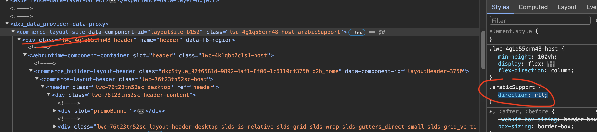

# Support RTL with LWR Sites

## Context
We are currently planning to use LWR Commerce Template to build a storefront that will support **English, French, Spanish and Arabic**.
- The logged in buyer will see the required storefront based on his profile's language initially
- The logged in buyer will have ability to switch between these languages within the same storefront

A few challenges that we are facing now:
- Switching the storefront UI from Right to Left languages to Left to Right language & vice versa - Arabic is not supported OOTB by LWR template
  - We have explored the dir=rtl HTML tag and the direction:rtl CSS tag
  - But we haven't been able to use Javascript to get it working when we inserted it into the Experience Builder's Head Markup
- Approach to making standard components support right to left language
  - Have you had any success with a reliable approach to get standard LWR commerce components to support RTL languages?
- Guidelines for custom component development
  - Have you had any best practices to support custom LWR commerce components to support RTL languages?
- Any other caveats we should look out for, specific to RTL language support for LWR commerce templates, or LWR templates in general

This niche use case may be necessary if the following business requirements apply:
- Implement a headless checkout process (not relying on store managed checkout).
- Use a saved payment method instead of capturing payment details during checkout.

## Notes

## Prerequisites

## Implementation Details

The idea is to bind `direction: rtl;` to the parent component in your site post-rendering. In most use cases, that would be the element commerce-layout-site



First thing to do is add the trigger code to the Head Markup, this snippet will look for the cookie `PreferredLanguage<siteId>` that's generated when the user changes the default language (so this whole process will work if Arabic is not the default language, which I believe is the case with your site). So let's analyze this code:
- when page loads
- look for the guilty cookie
- if it's there and has arabic as value
- toggle on the custom class that's responsible for setting correct arabic styling/tweaking

```
<script type="text/javascript">
    window.addEventListener("load", (event) => {
        console.log("DOM fully loaded and parsed");
        const match = document.cookie.match(new RegExp('(^| )' + 'PreferredLanguage' + '\\S+=([^;]+)'));
        if (match && match[2] === 'ar') {
            const parentElement = document.getElementsByTagName('commerce-layout-site')[0];
            parentElement.classList.toggle('arabicSupport');
        }
   });
</script>
```

> make sure you set the Site security to `Relaxed CSP: Permit Access to Inline Scripts and Allowed Hosts` in order to allow inline scripts to function, this won't reduce your security as the inline code is messing with styling, no external code is getting triggered.

Same in the head markup, add the styling class:
```
<style>
    .arabicSupport {
        direction: rtl;
    }
</style>
```

This should be in the head markup and not in a LWC level so it can be bound to OOTB components. That's it for the standard components


> Guidelines for custom component development

Following same approach, you'll now need to add classes related to that special class `arabicSupport` , so a custom component will have a class

```
.someClassName .arabicSupport {
   direction: rtl;
}
```
this styling will be triggered only if `arabicSupport` is bound to the main container, which is controlled by the code above

other caveats
- obviously, the whole content should be translated in order to show full Arabic content, that's why my screenshots aren't showing full Arabic text, Translation Workbench will be your new friend
- using this approach, you may need to tweak some styling for Arabic content, you'll use special styling via CSS classes also, the main container is helping you with 90% of the work, but 10% may need to be manually done on the components level

## Additional Resources