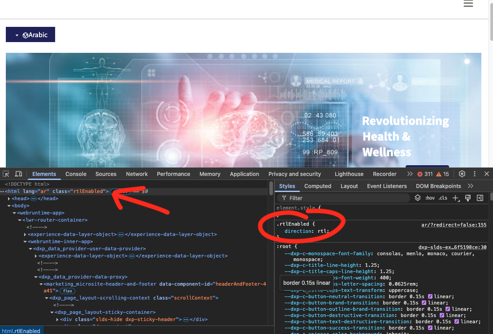
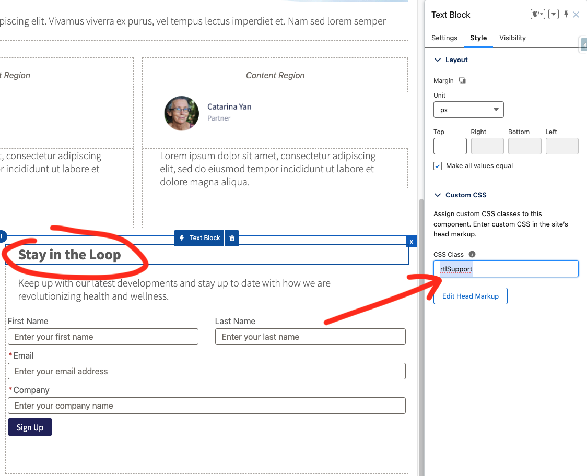
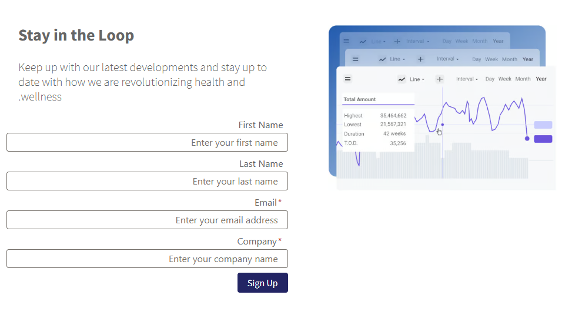
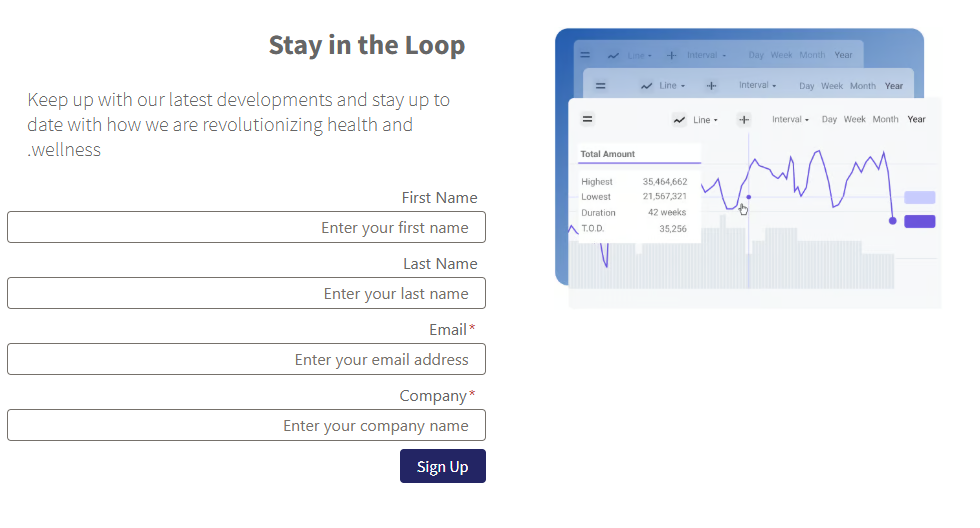

# Support RTL Layouts in LWR Sites

## Context
- You have a requirement to build an LWR Site with support of multiple languages.
- The user will see the site based on his profile's language initially.
- The user will have ability to switch between site supported languages.
- Site should be displayed in RTL layout for languages supporting RTL (e.g Arabic)

Here is some guidance you may follow for RTL with LWR.

## Notes
- RTL is not officially supported in an OOTB fashion. Customers should be able to achieve RTL by adding `dir="rtl"` to the body tag of the site and then making some CSS and layout adjustments to the site to make it meet their needs.

## Prerequisites
- Check the [Right-to-Left (RTL) Language Support](https://help.salesforce.com/s/articleView?id=xcloud.faq_getstart_rtl.htm&type=5)
- Check the [Add a Language to Your LWR Site](https://developer.salesforce.com/docs/atlas.en-us.exp_cloud_lwr.meta/exp_cloud_lwr/multilingual_lwr_add_language.htm)
- Check the [Automatic Language Detection for Multilingual LWR Sites](https://developer.salesforce.com/docs/atlas.en-us.exp_cloud_lwr.meta/exp_cloud_lwr/multilingual_lwr_automatic_language_detection.htm)

## Implementation Details

The idea is to bind `direction: rtl;` to the html element in your site after rendering.



First thing to do is add the trigger code to the Head Markup, this snippet will look for the cookie `PreferredLanguage<siteId>` that's generated when the user changes the default language to an RTL supported language.
> This process will work if the RTL language is not the default language, if the requirement is different, the JS code should be adjusted.

```
<script type="text/javascript">
    window.addEventListener("load", (event) => {
        console.log("DOM fully loaded and parsed");
        const match = document.cookie.match(new RegExp('(^| )' + 'PreferredLanguage' + '\\S+=([^;]+)'));
        // languages for which flip layout to RTL
        if (match && match[2] === 'ar') {
            const parentElement = document.documentElement;
            parentElement.classList.toggle('rtlEnabled');
        }
   });
</script>
```

So let's analyze this code:
- when page loads
- look for the guilty cookie
- if it's there and has as value one of the RTL supported languages
- toggle on the custom class that's responsible for setting correct RTL styling/tweaking

> Make sure you set the Site security to `Relaxed CSP: Permit Access to Inline Scripts and Allowed Hosts` in order to allow inline scripts to function, this won't reduce your security as the inline code is messing with styling, no external code is getting triggered.

Same in the head markup, add these styling classes:
```
<style>
    .rtlEnabled {
        direction: rtl;
    }
</style>
```

| Without RTL Changes                          | With RTL Changes                          |
|---------------------------------------------|-------------------------------------------|
|     |    |

> Guidelines for custom adjustments on standard and custom components

The previous approach will usually do most of the work to show your site in RTL layout, still, some standard or custom components will/may require further adjustments, to do that, you can follow these steps:
- add your adjustments to a new CSS class with a selector including the `rtlEnabled`, example:
```
.rtlEnabled .rtlSupport {
    justify-items: right; /* additional adjustments*/
}
```
- bind the CSS class to the standard or custom component using the Style tab in Experience Builder like below

- publish your changes

You can see the effect of this approach in the screenshots below (compare the alignment of the text `Stay in the Loop`):

| RTL + No Adjustments            | RTL + Additional Adjustments          |
|---------------------------------------------|-------------------------------------------|
|  |  |

**How this works?** This last styling (`rtlSupport`) will be applied only if `rtlEnabled` is bound to the main container, which is controlled by the JS in first section.

Caveats:
- obviously, the whole content should be translated in order to show full RTL language, Translation Workbench will be your new friend
- using this approach, you may need to tweak some styling for RTL content, you'll use special styling via CSS classes also, the main container is helping you with 90% of the work, but 10% may need to be manually done on the components level