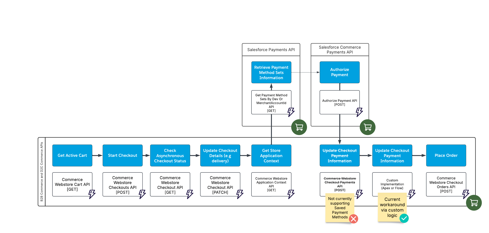

# Salesforce Headless Commerce Checkout with Saved Payment Method

## Context
This folder showcases how to implement Commerce Checkout (Cart to Order) in the Headless context using a combination of Commerce B2B/D2C, Salesforce Payments and Salesforce Commerce Payments APIs.

Such niche use case may be required to implement if the following business requirements are requested:
- Implement Headless Checkout Process (not relying on Standard Managed Checkout)
- Commerce Checkout to use already created Saved Payment Method instead of capturing payment method information at the checkout phase.

## Notes
- Full Headless Checkout with Salesforce Payments is not yet fully supported by Salesforce, this implementation is a suggested opiniated solution.

## Prerequisites
- Check Salesforce Mojo's video about [Headless Commerce Checkout](https://www.youtube.com/watch?v=fqJ0FyMTs04).
- Salesforce Payments already configured in the org with a proper Merchant Account and Payment Method Sets.
- Setup Postman with necessary information to authenticate as the external user (Store user).
- The process assumes that there is already an active cart with existing Cart Item records.

## Headless Commerce Checkout Process with Saved Payment Method (Salesforce Payments)

Below is the flow that describes the series of processes/APIs to call in order to create an order from a cart. As mentioned in the notes section, the flow is not currently 100% API driven. A custom logic is introduced as workaround after authorizing payment, this is needed because the `checkouts/active/payments` API is not yet supporting Saved Payment Method records.

| Process    | Resource | Method | Extra Permissions | Notes |
| -------- | -------- | ------- | -------- | ------- |
| Get Active Cart  | [Commerce Webstore Cart](https://developer.salesforce.com/docs/atlas.en-us.chatterapi.meta/chatterapi/connect_resources_commerce_webstore_cart.htm) | GET |   |     |
| Start Checkout  | [Commerce Webstore Checkouts](https://developer.salesforce.com/docs/atlas.en-us.chatterapi.meta/chatterapi/connect_resources_commerce_webstore_checkouts_start_checkout.htm) | POST  |   |     |
| Check Asynchronous Checkout Status | [Commerce Webstore Checkout](https://developer.salesforce.com/docs/atlas.en-us.chatterapi.meta/chatterapi/connect_resources_commerce_webstore_checkouts.htm) | GET  |   | While the asynchronous checkout processes (calculating shipping, taxes, promotions), GET requests return a 202 status. When checkout processing is complete, requests return a 200 status with up-to-date data. |
| Update Checkout Details | [Commerce Webstore Checkout](https://developer.salesforce.com/docs/atlas.en-us.chatterapi.meta/chatterapi/connect_resources_commerce_webstore_checkouts.htm) | PATCH  |   | Must include data for only one sub-resource in a single call, such as contact information (contactInfo), shipping information (deliveryAddress, desiredDeliveryDate, and shippingInstructions), or delivery method (deliveryMethodId). |
| Get Store Application Context | [Commerce Webstore Application Context](https://developer.salesforce.com/docs/atlas.en-us.chatterapi.meta/chatterapi/connect_resources_commerce_webstore_application_context.htm) | GET  |   | Goal is to get the `paymentMethodSetDevName` |
| Retrieve Payment Method Sets Information | [Get Payment Method Sets By Dev Or MerchantAccountId](https://developer.salesforce.com/docs/commerce/salesforce-commerce/references/comm-payments-ref?meta=getPaymentMethodSetsByDevOrMerchantAccountId) | GET  | `Authenticated Payer` Permission Set | Goal is to get the `gatewayId` |
| Authorize Payment | [Authorize Payment](https://developer.salesforce.com/docs/commerce/salesforce-commerce/references/comm-ccs-payments-ref?meta=authorizePayment) | POST  |   | <li>`paymentGroup.sourceObjectId` can be empty as it will be populated after the order is placed</li> <li>`paymentMethod.id` references the Saved Payment Method id</li> |
| Update Checkout Payment Information | Custom logic | N/A  | Custom WebCart Permissions | Custom logic update `WebCart.PaymentMethodId` and `WebCart.PaymentGroupId`, these fields may not be updatable by external user due to License/Sharing restrictions. Options to implement custom logic are: Composite API, Flows or Apex. |
| Place Order | [Commerce Webstore Checkout Orders](https://developer.salesforce.com/docs/atlas.en-us.chatterapi.meta/chatterapi/connect_resources_commerce_webstore_checkouts_place_order.htm) | POST |  |  |

## Additional Resources
- [Commerce B2B and D2C Resources](https://developer.salesforce.com/docs/atlas.en-us.chatterapi.meta/chatterapi/connect_resources_commerce.htm)
- [Salesforce Payments API](https://developer.salesforce.com/docs/commerce/salesforce-commerce/references/comm-payments-ref?meta=Summary)
- [Commerce Payments API](https://developer.salesforce.com/docs/commerce/salesforce-commerce/references/comm-ccs-payments-ref?meta=Summary)
- [Salesforce Mojo Headless Commerce APIs](https://github.com/shane-saltbox/Salesforce-Mojo/tree/main/Headless%20Commerce%20API's)