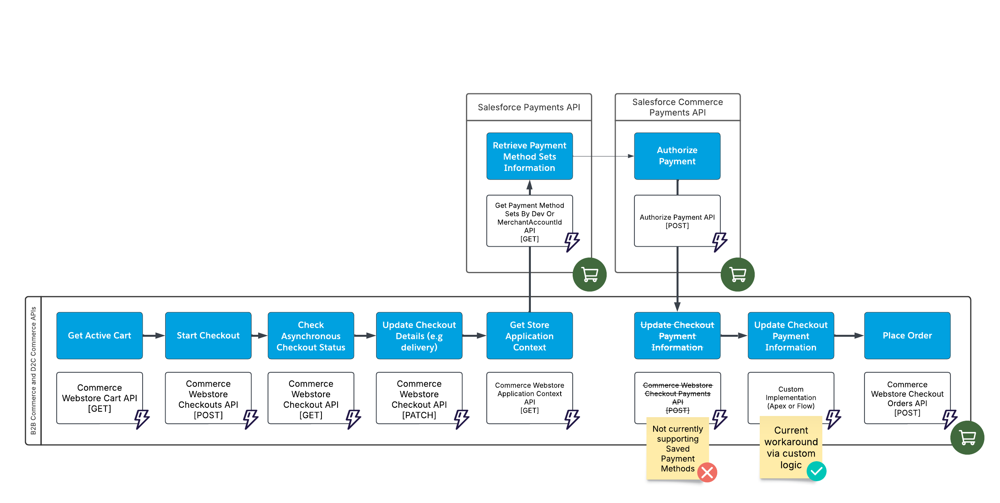

# Salesforce Headless Commerce Checkout with Saved Payment Method

## Context
This folder showcases how to implement Commerce Checkout (Cart-to-Order) in a headless context using a combination of B2B and D2C Commerce, Salesforce Payments, and Salesforce Commerce Payments APIs.

This niche use case may be necessary if the following business requirements apply:
- Implement a headless checkout process (not relying on store managed checkout).
- Use a saved payment method instead of capturing payment details during checkout.

## Notes
- A fully headless checkout with Salesforce Payments is not yet officially supported by Salesforce. This implementation presents a suggested solution based on personal experience with the Salesforce Payments capabilities.

## Prerequisites
- Watch Salesforce Mojo's video about [Headless Commerce Checkout](https://www.youtube.com/watch?v=fqJ0FyMTs04).
- Salesforce Payments must be configured in the org with a valid Merchant Account and associated Payment Method Sets.
- Set up Postman with the required authentication details for the external store user.
- This process assumes that an active cart with existing Cart Item records already exists.

## Postman Collection
Import the following collection to access the APIs mentioned in this solution: [Headless Commerce APIs.postman_collection.json](./assets/Headless%20Commerce%20APIs.postman_collection.json).

## Headless Commerce Checkout Process with Saved Payment Method (Salesforce Payments)

The following flow outlines the sequence of processes and API calls required to create an order from a cart. As mentioned in the notes section, the flow is not fully API-driven. Custom logic is introduced as a workaround after authorizing payment. This is necessary because the `checkouts/active/payments` API does not yet support Saved Payment Method records.

| Process    | Resource | Method | Extra Permissions | Notes |
| -------- | -------- | ------- | -------- | ------- |
| Get Active Cart  | [Commerce Webstore Cart](https://developer.salesforce.com/docs/atlas.en-us.chatterapi.meta/chatterapi/connect_resources_commerce_webstore_cart.htm) | GET | N/A |  |
| Start Checkout  | [Commerce Webstore Checkouts](https://developer.salesforce.com/docs/atlas.en-us.chatterapi.meta/chatterapi/connect_resources_commerce_webstore_checkouts_start_checkout.htm) | POST  | N/A |  |
| Check Asynchronous Checkout Status | [Commerce Webstore Checkout](https://developer.salesforce.com/docs/atlas.en-us.chatterapi.meta/chatterapi/connect_resources_commerce_webstore_checkouts.htm) | GET  | N/A | During the asynchronous checkout process (e.g., calculating shipping, taxes, promotions), GET requests return a 202 status. When processing is complete, requests return a 200 status with up-to-date data. |
| Update Checkout Details | [Commerce Webstore Checkout](https://developer.salesforce.com/docs/atlas.en-us.chatterapi.meta/chatterapi/connect_resources_commerce_webstore_checkouts.htm) | PATCH  | N/A | Must include data for only one sub-resource per call, such as contact information, shipping details, or delivery method. |
| Get Store Application Context | [Commerce Webstore Application Context](https://developer.salesforce.com/docs/atlas.en-us.chatterapi.meta/chatterapi/connect_resources_commerce_webstore_application_context.htm) | GET  | N/A | Goal is to retrieve the `paymentMethodSetDevName`. |
| Retrieve Payment Method Sets Information | [Get Payment Method Sets By Dev Or MerchantAccountId](https://developer.salesforce.com/docs/commerce/salesforce-commerce/references/comm-payments-ref?meta=getPaymentMethodSetsByDevOrMerchantAccountId) | GET  | `Authenticated Payer` Permission Set | Goal is to retrieve the `gatewayId`. |
| Authorize Payment | [Authorize Payment](https://developer.salesforce.com/docs/commerce/salesforce-commerce/references/comm-ccs-payments-ref?meta=authorizePayment) | POST  | N/A | - `paymentGroup.sourceObjectId` can be empty, as it will be populated after the order is placed.   - `paymentMethod.id` references the Saved Payment Method ID. |
| Update Checkout Payment Information | Custom logic | N/A  | Custom WebCart Permissions | Custom logic updates `WebCart.PaymentMethodId` and `WebCart.PaymentGroupId`. These fields may not be updatable by external users due to license/sharing restrictions. Options for implementation include Composite API, Flows, or Apex. |
| Place Order | [Commerce Webstore Checkout Orders](https://developer.salesforce.com/docs/atlas.en-us.chatterapi.meta/chatterapi/connect_resources_commerce_webstore_checkouts_place_order.htm) | POST | N/A |  |

## Additional Resources
- [Commerce B2B and D2C Resources](https://developer.salesforce.com/docs/atlas.en-us.chatterapi.meta/chatterapi/connect_resources_commerce.htm)
- [Salesforce Payments API](https://developer.salesforce.com/docs/commerce/salesforce-commerce/references/comm-payments-ref?meta=Summary)
- [Commerce Payments API](https://developer.salesforce.com/docs/commerce/salesforce-commerce/references/comm-ccs-payments-ref?meta=Summary)
- [Salesforce Mojo Headless Commerce APIs](https://github.com/shane-saltbox/Salesforce-Mojo/tree/main/Headless%20Commerce%20API's)
